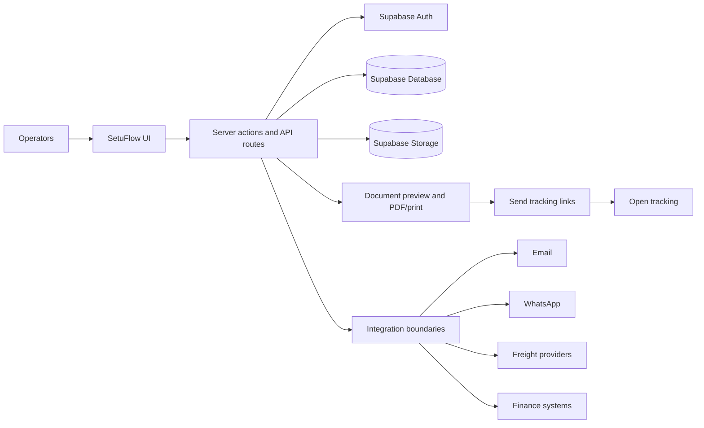

# SetuFlow CRM Training Materials

Generated: 2026-05-18

Source: `docs/SETUFLOW_DOCUMENTATION_SUITE.md`

Purpose:
- Simple visuals.
- Short slide-ready teaching content.
- Click-by-click operator guides.
- Quick-reference cheat sheets.
- Training-friendly architecture map.

This file does not replace the full documentation suite. It is the simplified training layer.

## 1. Workflow Images

### 1.1 Lead Workflow

```text
[Capture]
   CTA: Save lead
      |
      v
[Follow-up Queue]
   CTA: Open
      |
      v
[Command Center]
   CTAs: Inspect qualification | Inspect coverage | Inspect follow-up
      |
      v
[Coverage + Compliance]
   CTAs: Open coverage manager | Compliance check
      |
      v
[Quote Ready]
   CTA: Create quote / Continue quote
```

Training message:
- A lead is not quote-ready until product coverage is saved.
- Compliance can be fixed from the lead or quote context.

### 1.2 Quote Workflow

```text
[Open Quote]
   CTA: Create quote
      |
      v
[Add Products]
   CTA: Add product
      |
      v
[Review Price + Terms]
   CTA: Save draft
      |
      v
[Clear Blockers]
   CTAs: Attach evidence | Waive for quote | Defer to dispatch
      |
      v
[Send Quote]
   CTA: Send quote
      |
      v
[Buyer Outcome]
   CTAs: Mark accepted | Mark rejected
```

Training message:
- Send only after approval and blockers are clear.
- A sent quote becomes locked.

### 1.3 Quote Versioning Workflow

```text
[Draft Version]
   editable
      |
      v
[Current Version]
   review + price snapshot
      |
      v
[Sent Version]
   locked after send
      |
      v
[Accepted Version]
   source for order
      |
      v
[Order Source]
   actual order lines start here
```

Training message:
- Do not edit a sent quote.
- Create a revision when commercial terms change.

### 1.4 Order Execution Workflow

```text
[Quote Approved]
   CTA: Prepare actual lines
      |
      v
[Internal Approval]
   CTA: Approve actual lines
      |
      v
[First Document]
   CTAs: Prepare document -> Preview -> Approve -> Send tracked
      |
      v
[Packing / Freight]
   CTAs: Prepare packing sheet | Prepare freight request
      |
      v
[Processing]
   CTA: Save processing check
      |
      v
[Dispatch / Invoice]
   CTAs: Create shipment draft | Approve dispatch | Approve invoice
      |
      v
[Paid & Closed]
   CTA: Generate receipt + close
```

Training message:
- Order execution starts from the accepted quote.
- Actual order lines can differ, but reasons must be saved.

### 1.5 Packing Workflow

```text
[First Document Approved]
      |
      v
[Prepare Packing Sheet]
   CTA: Prepare packing sheet
      |
      v
[Preview Packing Sheet]
   CTA: Preview packing sheet
      |
      v
[Approve Packing Sheet]
   CTA: Approve packing sheet
      |
      v
[Processing / Freight Unlocked]
```

Training message:
- Packing sheet must be approved before processing and freight actions.

### 1.6 Freight Workflow

```text
[Packing Approved]
      |
      v
[Prepare Freight Request]
   CTA: Prepare freight request
      |
      v
[Preview Freight Request]
   CTA: Preview freight request
      |
      v
[Approve Freight Request]
   CTA: Approve freight request
      |
      v
[External Provider Boundary]
   manual/provider adapter step
```

Training message:
- SetuFlow prepares and approves freight request data.
- External freight booking is not automatic by default.

### 1.7 Processing Workflow

```text
[Packing Approved]
      |
      v
[Pick]
   check picked
      |
      v
[Pack]
   check packed
      |
      v
[QC]
   check QC passed
      |
      v
[Delivery / Logistics Unlocked]
   CTA: Save processing check
```

Training message:
- Picked, packed, and QC passed must all be complete before delivery/logistics can move forward.

### 1.8 Dispatch Workflow

```text
[Processing Approved]
      |
      v
[Logistics Documents]
   CTA: Approve logistics docs
      |
      v
[Shipment Draft]
   CTA: Create shipment draft
      |
      v
[Trade Requirement Check]
   CTA: Confirm source / resolve blockers
      |
      v
[Dispatch Release]
   CTA: Approve dispatch
```

Training message:
- Dispatch is blocked until shipment draft exists and blocking trade requirements are resolved.

### 1.9 Finance and Closeout Workflow

```text
[Final Invoice]
   CTAs: Preview final invoice -> Approve invoice
      |
      v
[Send Tracking]
   CTA: Send final invoice again
      |
      v
[Payment]
   enter payment reference
      |
      v
[Reconciliation]
   confirm no outstanding amount
      |
      v
[Archive + Receipt]
   CTA: Generate receipt + close
```

Training message:
- Close only after invoice approval, payment, reconciliation, receipt acknowledgment, and archive confirmation.

## 2. Training Slide Deck Content

### Slide 1: Lead Workflow

Subtitle:
Turn captured contacts into quote-ready leads.

Bullets:
- Capture the lead.
- Open the Follow-up queue.
- Complete qualification, coverage, and follow-up.
- Clear compliance blockers before quote send.
- Create or continue the quote only when ready.

Diagram:

```text
Capture -> Follow-up -> Command Center -> Coverage -> Quote Ready
```

What operators must do:
- Save product coverage.
- Check country/market.
- Plan next follow-up.

Common mistakes:
- Trying to quote without product coverage.
- Leaving follow-up blank.
- Ignoring compliance warnings.

Do NOT do this:
- Do not treat free-text product notes as saved product coverage.

### Slide 2: Quote Workflow

Subtitle:
Build a clean, approved quote before sending.

Bullets:
- Start from the lead or Quote workspace.
- Add catalog products.
- Review price, currency, terms, and validity.
- Resolve blockers.
- Send only after approval is clear.

Diagram:

```text
Create quote -> Add products -> Review terms -> Clear blockers -> Send quote
```

What operators must do:
- Add products from the catalog where possible.
- Record override reasons.
- Check approval and compliance.

Common mistakes:
- Sending while approval is pending.
- Forgetting quote validity or currency.
- Missing evidence for compliance.

Do NOT do this:
- Do not send a quote with unresolved blockers.

### Slide 3: Quote Versioning

Subtitle:
Keep sent offers locked and traceable.

Bullets:
- Draft versions are editable.
- Sent versions are locked.
- Accepted version becomes the order source.
- Revisions should create new versions.
- Quote history must stay clean.

Diagram:

```text
Draft -> Current -> Sent LOCKED -> Accepted -> Order Source
```

What operators must do:
- Review before sending.
- Revise instead of editing sent versions.
- Use the accepted version for order execution.

Common mistakes:
- Editing old quote details after buyer approval.
- Confusing current draft with sent version.

Do NOT do this:
- Do not change a sent or accepted quote version.

### Slide 4: Order Execution

Subtitle:
Turn an accepted quote into controlled execution.

Bullets:
- Prepare actual order lines.
- Approve actual lines before documents.
- Prepare, preview, and approve documents.
- Use tracked sends.
- Move stage by stage.

Diagram:

```text
Accepted Quote -> Actual Lines -> First Document -> Packing -> Dispatch -> Close
```

What operators must do:
- Confirm actual buyer quantities.
- Save reasons for changes.
- Approve before sending buyer documents.

Common mistakes:
- Assuming quoted quantity equals ordered quantity.
- Sending documents before approval.

Do NOT do this:
- Do not edit the accepted quote to match the order.

### Slide 5: Packing Workflow

Subtitle:
Use approved order data to prepare packing.

Bullets:
- First buyer document must be approved.
- Packing sheet is prepared from actual order lines.
- Preview before approval.
- Approval unlocks processing and freight.

Diagram:

```text
First document approved -> Prepare packing -> Preview -> Approve -> Unlock next steps
```

What operators must do:
- Check quantity and product details.
- Use the correct packing template.
- Approve only after review.

Common mistakes:
- Preparing packing before first document approval.
- Forgetting to review quantities.

Do NOT do this:
- Do not use unapproved packing data for freight or warehouse work.

### Slide 6: Freight Workflow

Subtitle:
Prepare freight information after packing is approved.

Bullets:
- Freight request starts after packing approval.
- Request should reflect actual packing details.
- Preview before approval.
- External booking is outside default SetuFlow automation.

Diagram:

```text
Packing approved -> Freight request -> Preview -> Approve -> Provider boundary
```

What operators must do:
- Confirm origin, destination, and incoterm.
- Check packing basis.
- Approve before external sharing.

Common mistakes:
- Requesting freight with incomplete packing details.
- Treating request approval as carrier booking.

Do NOT do this:
- Do not assume SetuFlow booked freight automatically.

### Slide 7: Processing Workflow

Subtitle:
Confirm goods are picked, packed, and quality checked.

Bullets:
- Processing starts after packing approval.
- Pick, pack, and QC must be complete.
- Incomplete checks can be saved.
- Complete checks unlock delivery/logistics.

Diagram:

```text
Packing approved -> Pick -> Pack -> QC -> Logistics unlocked
```

What operators must do:
- Save real processing status.
- Add notes when incomplete.
- Proceed only when QC passes.

Common mistakes:
- Marking complete before QC.
- Skipping notes for exceptions.

Do NOT do this:
- Do not unlock delivery until processing is genuinely complete.

### Slide 8: Dispatch Workflow

Subtitle:
Release shipment only after docs and blockers are clear.

Bullets:
- Approve logistics documents.
- Create shipment draft.
- Check trade requirements.
- Resolve blockers before dispatch.
- Approve dispatch release.

Diagram:

```text
Processing approved -> Logistics docs -> Shipment draft -> Requirement check -> Dispatch
```

What operators must do:
- Confirm document readiness.
- Confirm shipment draft.
- Resolve blocking trade requirements.

Common mistakes:
- Dispatching before shipment draft.
- Ignoring requirement severity.

Do NOT do this:
- Do not dispatch while blocking trade requirements are open.

### Slide 9: Finance and Closeout

Subtitle:
Close only when payment and records are complete.

Bullets:
- Final invoice must be approved.
- Payment must be received.
- Reconciliation must be complete.
- Outstanding amount must be zero.
- Receipt and archive must be confirmed.

Diagram:

```text
Final invoice -> Payment -> Reconciliation -> Receipt + Archive -> Closed
```

What operators must do:
- Enter payment reference.
- Confirm reconciliation.
- Archive documents.

Common mistakes:
- Closing before payment clears.
- Leaving outstanding amount.
- Forgetting archive confirmation.

Do NOT do this:
- Do not close an order with unpaid or unreconciled balance.

## 3. Click-by-Click Operator Guides

### Lead Workflow

1. Click `Follow-up` in the main navigation.
2. Click `Open` on the lead row.
3. Expected UI state: the lead Command Center opens with workflow cards.
4. Expected data state: lead record is loaded from `leads`.
5. Verify product coverage, country/market, follow-up, and compliance before clicking `Create quote` or `Continue quote`.

### Quote Workflow

1. Click `Quote` in the main navigation.
2. Click `Create quote` or open an existing quote.
3. Expected UI state: quote builder/workspace opens with product and pricing sections.
4. Expected data state: quote draft, quote version, and line items are ready to save.
5. Verify products, currency, price, validity, approval, and blockers before clicking `Send quote`.

### Quote Versioning Workflow

1. Click `Quote`.
2. Select the quote you want to review.
3. Expected UI state: the current quote/version is visible.
4. Expected data state: sent or accepted versions are locked and traceable.
5. Verify you are working on a draft/revision before making changes. If already sent, create a revision instead of editing.

### Order Execution Workflow

1. Click `Orders / Execution`.
2. Click `Open` on the order row.
3. Expected UI state: one selected order opens with stage steps.
4. Expected data state: order is linked to accepted quote/version.
5. Verify actual order lines are prepared and approved before preparing buyer documents.

### Packing Workflow

1. Click `Orders / Execution`.
2. Open the order and select `Packing / Freight`.
3. Expected UI state: packing sheet actions are visible.
4. Expected data state: first buyer document is approved.
5. Verify the first document approval before clicking `Prepare packing sheet`.

### Freight Workflow

1. Click `Orders / Execution`.
2. Open the order and select `Packing / Freight`.
3. Expected UI state: freight request actions are visible after packing approval.
4. Expected data state: packing sheet is approved and packing details exist.
5. Verify origin, destination, incoterm, and packing basis before clicking `Prepare freight request`.

### Processing Workflow

1. Click `Orders / Execution`.
2. Open the order and select `Processing`.
3. Expected UI state: pick, pack, and QC checks are visible.
4. Expected data state: processing checks can be saved against the order.
5. Verify picked, packed, and QC passed are all complete before proceeding to delivery/logistics.

### Dispatch Workflow

1. Click `Orders / Execution`.
2. Open the order and select `Logistics` or `Dispatch / Invoice`.
3. Expected UI state: logistics docs, shipment draft, and dispatch actions are visible.
4. Expected data state: shipment draft and document approvals are recorded.
5. Verify blocking trade requirements are resolved before clicking `Approve dispatch`.

### Finance and Closeout Workflow

1. Click `Orders / Execution`.
2. Open the order and select `Dispatch / Invoice`.
3. Expected UI state: final invoice actions are visible.
4. Expected data state: final invoice approval can be recorded before closeout.
5. Verify payment received, reconciliation complete, outstanding amount zero, receipt acknowledged, and documents archived before clicking `Generate receipt + close`.

## 4. Quick-Reference Cheat Sheets

### Lead Workflow Cheat Sheet

Summary:
- Goal: move a captured contact into quote-ready state.

Key CTAs:
- `Open`
- `More`
- `Open coverage manager`
- `Compliance check`
- `Create quote`
- `Continue quote`

Key blockers:
- No product coverage.
- Disqualified lead.
- Missing country/market.
- Missing follow-up.
- Compliance blocker.

Key readiness rules:
- Lead exists.
- Lead is not disqualified.
- Product interest is saved.
- Follow-up and compliance are clear enough to proceed.

Key documents:
- Quote-review evidence when required.

Key system behaviors:
- Product interest controls quote readiness.
- Compliance can block quote send later.

### Quote Workflow Cheat Sheet

Summary:
- Goal: create and send a clean commercial offer.

Key CTAs:
- `Create quote`
- `Add product`
- `Save draft`
- `Send quote`
- `Open customer PDF`
- `Mark accepted`
- `Mark rejected`

Key blockers:
- Missing products.
- Missing currency.
- Approval pending.
- Compliance evidence missing.
- No current version.

Key readiness rules:
- Quote has line items.
- Approval is clear.
- Blockers are resolved.

Key documents:
- Customer quote PDF/share output.

Key system behaviors:
- Sent quotes lock.
- Sends write communication and audit history.

### Quote Versioning Cheat Sheet

Summary:
- Goal: keep quote history clean and auditable.

Key CTAs:
- `Save draft`
- `Send quote`
- `Mark accepted`
- `Mark rejected`

Key blockers:
- Editing a locked version.
- Confusing draft and sent version.

Key readiness rules:
- Review before send.
- Revise instead of editing locked versions.

Key documents:
- Quote version PDF/share output.

Key system behaviors:
- Accepted version becomes order source.
- Version line items preserve commercial truth.

### Order Execution Cheat Sheet

Summary:
- Goal: turn accepted quote into controlled order execution.

Key CTAs:
- `Open`
- `Prepare actual lines`
- `Save`
- `Add line`
- `Approve actual lines`
- `Prepare document`
- `Preview`
- `Approve`
- `Send tracked`

Key blockers:
- No accepted quote lineage.
- Actual lines not approved.
- Document not approved before send.

Key readiness rules:
- Actual lines prepared.
- Differences have reasons.
- First document approved before external send.

Key documents:
- Proforma invoice for export.
- Order confirmation for regional.

Key system behaviors:
- Order lines can differ from quote lines.
- Accepted quote stays unchanged.

### Packing Cheat Sheet

Summary:
- Goal: prepare physical packing based on actual order lines.

Key CTAs:
- `Prepare packing sheet`
- `Preview packing sheet`
- `Approve packing sheet`

Key blockers:
- First document not approved.
- Missing order lines.

Key readiness rules:
- First buyer document approved.
- Packing sheet reviewed.

Key documents:
- Packing sheet.

Key system behaviors:
- Packing approval unlocks processing and freight.

### Freight Cheat Sheet

Summary:
- Goal: prepare freight request data after packing approval.

Key CTAs:
- `Prepare freight request`
- `Preview freight request`
- `Approve freight request`

Key blockers:
- Packing sheet not approved.
- Missing origin/destination/incoterm.

Key readiness rules:
- Packing basis is complete.
- Freight request is reviewed.

Key documents:
- Freight rate request / shipment instruction.

Key system behaviors:
- External freight booking is not automatic by default.

### Processing Cheat Sheet

Summary:
- Goal: confirm warehouse readiness.

Key CTAs:
- `Save processing check`
- `Confirm packed for loading`

Key blockers:
- Packing not approved.
- Pick/pack/QC incomplete.

Key readiness rules:
- Picked is complete.
- Packed is complete.
- QC passed is complete.

Key documents:
- Picklist or packing sheet.

Key system behaviors:
- Complete checks unlock delivery/logistics.

### Dispatch Cheat Sheet

Summary:
- Goal: release goods only when documents and requirements are clear.

Key CTAs:
- `Approve logistics docs`
- `Create shipment draft`
- `Confirm source`
- `Approve dispatch`

Key blockers:
- No shipment draft.
- Blocking trade requirements open.
- Logistics documents not approved.

Key readiness rules:
- Processing approved.
- Shipment draft exists.
- Trade blockers resolved.

Key documents:
- Delivery note.
- Packing list.
- Shipping documents.
- Commercial/final invoice.

Key system behaviors:
- Blocking trade requirements stop dispatch.

### Finance and Closeout Cheat Sheet

Summary:
- Goal: close the order after invoice, payment, reconciliation, and archive.

Key CTAs:
- `Preview final invoice`
- `Approve invoice`
- `Send final invoice again`
- `Generate receipt + close`
- `Download archive`

Key blockers:
- Final invoice not approved.
- Payment not received.
- Reconciliation incomplete.
- Outstanding amount above zero.
- Archive not confirmed.

Key readiness rules:
- Invoice approved.
- Payment reference entered.
- No outstanding balance.
- Receipt and archive confirmed.

Key documents:
- Final invoice.
- Receipt.
- Document archive.

Key system behaviors:
- Closeout completes the order only when all closeout checks pass.

## 5. Simplified Architecture Diagram

### Training-Friendly Architecture



Plain-language view:

```text
Operator clicks in SetuFlow
      |
      v
Next.js screens collect the action
      |
      v
Server actions check rules and permissions
      |
      v
Supabase saves the truth
      |
      v
Documents and tracked links are generated
      |
      v
External systems are boundaries unless a connector is enabled
```

Training notes:
- Frontend: what operators see and click.
- Backend: the rule checker.
- Supabase: the source of truth.
- Storage: uploaded files and assets.
- Document engine: previews, print/PDF, document status.
- Send tracking: link created, opened, recipient/channel history.
- Integrations: email, WhatsApp, freight, and finance boundaries.

Important reminder:
- `Link created` does not mean delivered.
- `Opened` means the preview link was accessed.
- Freight and finance actions are not automatic external posting unless a connector is enabled.
